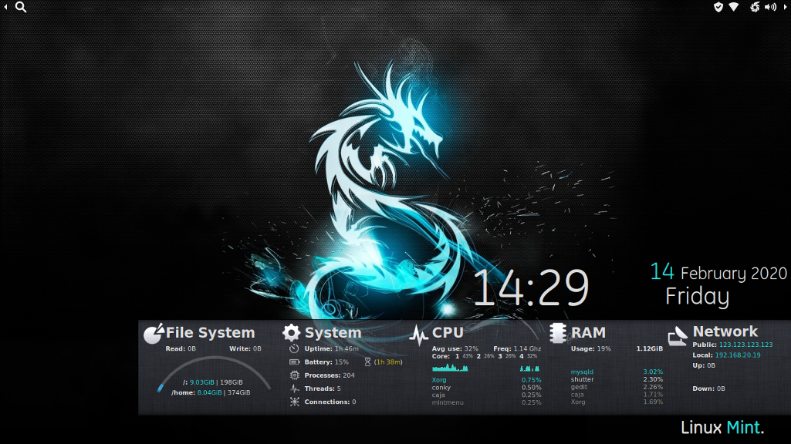
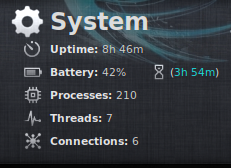
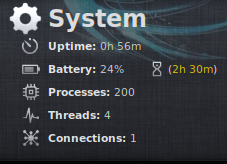
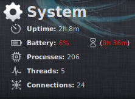
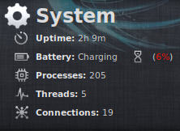
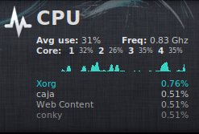
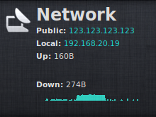

# Conky-Xanimos
My customized conky setup. I started with a conky config I found on deviant art, credited below, and then heavily modified it to my liking.

### Table of contents
* [Deviations](#deviations)
* [How it Looks](#how-it-looks)
* [Installation](#installation)
* [Credits](#credits)

## Deviations
Here's a list of what I can remember I for sure changed from the version I started modifying:
* Orientated to bottom right instead of bottom left
  * Allows for smaller screen sizes
* Condensed windows to fit smaller screens
* Removed non-used scripts
* Moved various pieces around/Changed positioning
* Added in more to system config
  * Battery life inclusions with color changing
  * Battery charging with colors
  * Icons for texts
* Changed Colors
* Network changes _(Note: you may need to modify this to work on your adapter)_
  * Fixed public IP source
  * Used built in graphs instead of previous lua that wasn't functioning

## How it Looks
#### Full Desktop view


#### Battery Full(ish) Indication


#### Battery Medium Indication


#### Battery Low Indication


#### Battery Charging Indication

_(The battery percentage changes the same colors/timing as time left from above pictures)_

#### CPU Usage


#### Network usage

_(My IP is not 123.123.123.123 FTR)_

## Installation

Place all folders in your home directory to achieve the following:
```shell
~
|-- .conky
|   `-- conky-xanimos
|       |-- configs
|       |   |-- conky_bg
|       |   |-- conky_clock
|       |   |-- conky_cpu
|       |   |-- conky_files
|       |   |-- conky_network
|       |   |-- conky_ram
|       |   |-- conky_system
|       |   `-- conky_txt
|       |-- img
|       |   |-- bg2.png
|       |   |-- bg.png
|       |   |-- cpu.png
|       |   |-- files.png
|       |   |-- networkhigh.png
|       |   |-- networklow.png
|       |   |-- networkmid.png
|       |   |-- nonetwork.png
|       |   |-- ram.png
|       |   |-- system.png
|       |   `-- units
|       |       |-- batt.png
|       |       |-- connections.png
|       |       |-- freq.png
|       |       |-- hdd.png
|       |       |-- processes.png
|       |       |-- proc.png
|       |       |-- timeleft.png
|       |       `-- uptime.png
|       |-- lua
|       |   `-- files_ring.lua
|       |-- conky_start.sh
|       `-- README.md
```
The other files are not required for usage, but you'll need to ensure the font GE Inspira is correctly installed for conky_txt to display properly.

Then run _(or add to startup commands)_:
```shell
~/.conky/conky-xanimos/conky_start.sh
```

## Credits
#### Original Conky-Bar
* [Conky-Bar](https://www.deviantart.com/n00by4ever/art/ConkyBar-Conky-config-Conky-1-10-401254455)

#### Font (Included)
* [GE Inspira](https://ufonts.com/fonts/ge-inspira.html)

#### Wallpaper
* [Dragon](https://www.pling.com/s/Artwork/p/1359055)
